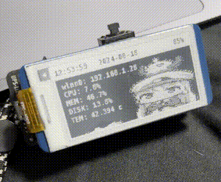

# raspberry pi zero display
show status and animation on your RPI

## preview


## hardware require
- Raspberry pi zero 
- Waveshare 2.13Inch E-Ink Display HAT
- UPS-Lite V1.3

## installation

```bash
sudo apt update
sudo apt install python3 git -y 
git clone https://github.com/krittakondev/pizero-screen.git
cd pizero-screen
python3 -m venv screenenv
./screenenv/bin/pip3 install -r ./requirements.txt
```
## run

```bash
./screenenv/bin/pip3 install -r ./requirements.txt
```
